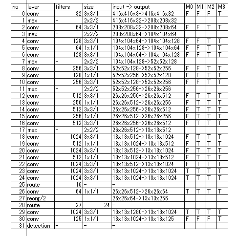
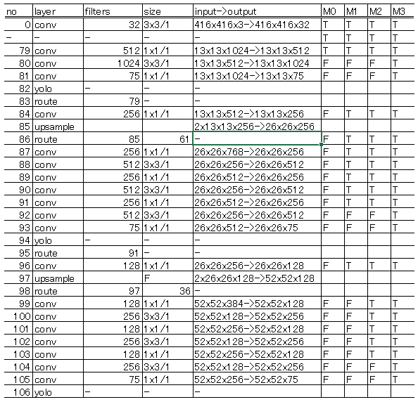

# Experiment of training Full Ternary Weight Network(FTWN) with darknet and YOLO

reference papers
- [Training a Binary Weight Object Detector byKnowledge Transfer for Autonomous Driving](https://arxiv.org/pdf/1804.06332.pdf)  
- [Ternary weight networks](https://arxiv.org/pdf/1605.04711.pdf)  
- [XNOR-Net: ImageNet Classification Using BinaryConvolutional Neural Networks](https://arxiv.org/pdf/1603.05279.pdf)  

## Abstract  
Generally the inference task using full ternary weights -1,0,+1 with scaling factor Wl is considered as low accuracy than full precision weights.  
But for mobile devices such as raspberryPI small weights is efficiency choice.  
And FPGA devices needs simple culculation mechanism like ternary weights based one.  
Many quantization method for model weights are proposed now such as FP16, bfloat, fixed point 16bits, 8bit, ternary 2bits and XNor 1bit too.  
I consider that re-training after quatization of weights is needed.  
How to train using some quantization methods? from ground, finetune?  

## Staged Training Method(STM)
I propose the staged training method for yolov2-voc.cfg, yolov3-voc.cfg on [Darknet website](https://github.com/pjreddie) for full ternary weights network.  
And to compare STM I also train each models with usual training method.  

STM generates Ternarized weights for yolov2-voc, yolov3-voc.  
STM sprits usual training method into 4 stages.  

Stage-0 : few layers without around detection layers are ternarized and training.  
Stage-1 : 40% of all layers are ternarized and training.  
Stage-2 : 90% of all layers are ternarized and training.  
Stage-3 : full ternarized and training.  

Weights used on each stages is imported from previous stage, such as stage-2 weights from stage-1.  
Look at staging plans for yolov2 and yolov3 figure.1 or figure.2 as example case.

I trained yolov2-voc.cfg and yolov3-voc.cfg with STM, and checked each training curves.  

## Result of STM with VOC  
My experiments denote that accuracy drops 5 points mAP against full precision weights inferece. 

**result of STM based on yolov2-voc.cfg**  

|Stage    |mAP  |IOU  |comments        |  
|-        |-    |-    |-               |  
|         |76.85|54.67|official weights|  
|M0       |77.09|57.04|                |  
|M1       |76.44|56.18|                |  
|M2       |75.06|57.71|                |  
|M3       |73.82|54.90|full ternary    |
|no staged|72.93|57.90|FT with darknet19_448.conv.23, full ternary    |

Interation 41000(2000/class), steps x0.1 80%, 90%, lr=0.001  

**result of STM based on yolov3-voc.cfg**  

|Stage    |mAP  |IOU  |comments        |  
|-        |-    |-    |-                                          |  
|-        |75.54|62.78|FT form darknet53.conv.75                  |  
|M0       |75.02|63.04|                                           |  
|M1       |73.69|63.75|                                           |  
|M2       |73.76|63.54|                                           |  
|M3       |71.26|61.61|full ternary                               |  
|no staged|69.81|55.13|FT form darknet53.conv.75, full ternary    |  

Interation 100400(5000/class), steps x0.1 80%, 90%, lr=0.001 at no stage, M0, M1  
Interation 60400(3000/class), steps x0.1 80%, 90%, lr=0.001 at M2, M3  

## How to run STM for yolov2-voc.cfg  
1. prepare official weights that include full precision weights or train your model.cfg with VOC dataset.  
   I wget yolov2-voc.weights from pjreddie web site.  
   And prepare .data file too.  

2. create shell command file such as darknet.sh like below,  
   ./darknet detector train voc_M0.data yolov2-voc_M0.cfg yolov2-voc.weights  
   ./darknet detector train voc_M1.data yolov2-voc_M1.cfg backup_M0/yolov2-voc_M0.minloss.weights  
   ./darknet detector train voc_M2.data yolov2-voc_M2.cfg backup_M1/yolov2-voc_M1.minloss.weights  
   ./darknet detector train voc_M3.data yolov2-voc_M3.cfg backup_M2/yolov2-voc_M2.minloss.weights  

3. go  
   ./darknet.sh

Here yolov2-voc_M\*.minloss.weigts file is saved at minimum loss.  
I spended 10days to get result of staged training yolov2 with GTX1080 x 2 environment.  

**staging plans**  
In below figures F denotes full precision weights layer and T denotes ternary weight layer.  

  
figure.1 yolov2 staging plan  

  
figure.2 yolov3 staging plan  

## Conclusion  
I made experiments of FTWN training with STM.  
I improved darknet framework to support ternarizing weights in convolutional layer.  
STM can reduce accuracy damage with FTWN.  

## More informations regrading this repo.  
- [segmenter](README_segmenter.md)  
- scale_channels layer support for efficientNet  
